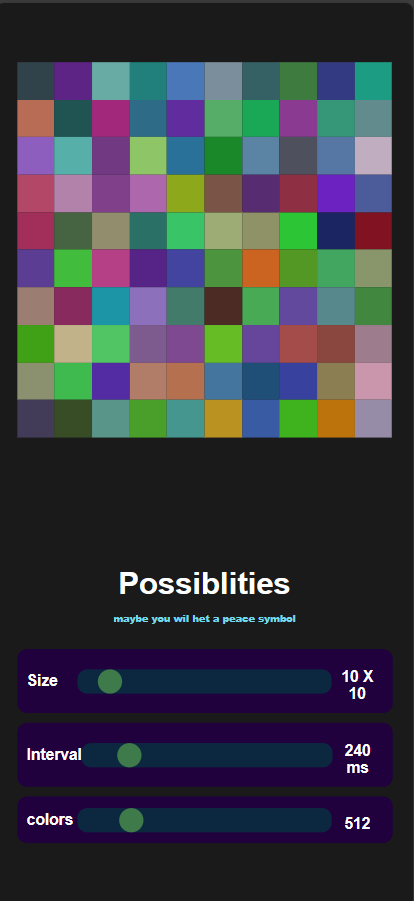

# Possibilities

Possibilities is a web application built with SvelteKit. It is used to create random color combinations in n*n grids, with a possibility to get some recognizable shapes.
theoretically, it should be able to generate All low resolution images, like the image of old game charecters or even you in 100*100 resolution, but with less than 1 in a trillion chance.

## Features
- Change the number of rows and columns in the grid
- Change the bit depth of the colors ( number of colors  combinations)
- refresh rate of the image
- theoretical possibility of getting recognizable shapes
- lots of fun

## screenshots
<p align="center">
  
  
  
  
</p>
## Getting Started

These instructions will get you a copy of the project up and running on your local machine for development and testing purposes.

### Prerequisites

- Node.js
- npm

### Installing

1. Clone the repository
```bash 
https://github.com/SreejithKSGupta/possibilities.git
```
2. Install dependencies
```bash
npm install
```
3. Start the development server
```bash
npm run dev
```
4. Open the browser and navigate to [http://localhost:3000](http://localhost:3000)

## Built With
1. [SvelteKit](https://kit.svelte.dev/) - The web framework used
2. CSS
3. HTML
4. hosted in [Vercel](https://vercel.com/)

## Authors
- **Sreejith K S Gupta** - [SreejithKSGupta](https://myportfolio-8fi.pages.dev/)

## License
This project is licensed under the MIT License - see the [LICENSE.md](LICENSE.md) file for details
